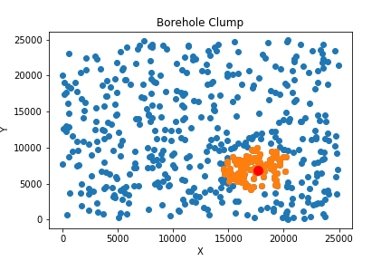
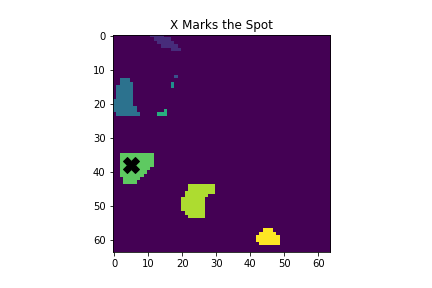

# Geokata Challenges

These [geokata](https://agilescientific.com/blog/2020/4/16/geoscientist-challenge-thyself) are a series of geoscience themed coding challenges from Agile scientific in the style of Advent of Code.


## Notes on specific challenges

### [0. Sequence](kata/00_Sequence.ipynb)
Analyze a measured section represented by a string of facies codes to find facies counts, beds, and facies transitions.
* `collections.Counter` is a useful datatype for creating counts.

* Initially, I used a while loop over the section to find runs of consecutive facies (ie "beds"). After searching around, I found [this gist](https://gist.github.com/alimanfoo/c5977e87111abe8127453b21204c1065) that contains vectorized code to find consecutive runs in a numpy array. I had to modify it slightly to use the `np.char` module to properly work with strings. The vectorized code runs almost 4 times faster on the full section than the while loop.

### [1. Boreholes](kata/01_Boreholes.ipynb)
Examine a list of borehole (x,y) locations to calculate distances and find nearest neighbors.

* KDTrees are very fast and efficient for nearest neighbor search problems



### [2. Sample-Names](kata/02_Sample-Names.ipynb)
Clean and parse some tabular data representing field samples.
* `pd.to_datetime()` is a useful function for parsing strings to dates. A few notes on what I learned about it in this challenge:
    * Passing the `format` keyword argument is not required. The function is able to determine the datetime format of each item in the series. However, if a specific format *is* expected, including the [strftime](https://strftime.org/) format string will significantly enhance performance. Including the `%Y-%m-%d` format string resulted in nearly a 6 fold improvement in runtime over the 9121 entry dataframe.
    
    * If an entry does not match the given format, there are a few options to how the function handles the response:
        
        * `errors='raise'` : invalid entry will raise an exception. This is the default
        * `errors='coerce'`: invalid entry will return NaT
        * `errors='ignore'`: invalid entry will return the input
        

* `pd.DataFrame.diff()`: calculate the difference between an element in a dataframe and the previous element. Also see `pd.DataFrame.shift()`¶

* Beware of off-by-one errors! The period of days between two dates is not the difference between the dates!


### [3. Prospecting](kata/03_Prospecting.ipynb)
Process geological property and land ownership maps to identify prospect locations.

* This challenge is a great use case for 3-dimensional numpy arrays. I have decent experience with numpy, but most applications I have had so far have only required 2 dimensional arrays. Indexing arrays in multiple dimensions is a little bit tricky, or at least requires adjusting my thinking. I am used to thinking about axis 0 representing the rows of an array and axis 1 representing the columns. When you add a dimension, in this case for additional maps, axis 0 represents the map, axis 1 represents the rows of each map, and axis 2 represents the columns of each map. To generalize this, I think it helps to think about axis -1 (the last axis) representing the columns, axis -2 representing the rows, and additional dimensions decreasing from there.

* [scipy.ndimage](https://docs.scipy.org/doc/scipy/reference/ndimage.html) contains many useful functions for image processing including filters, transforms, measurement, and morphology. This challenge used `scipy.ndimage.measurements.labels` to identify connected prospect "blobs" and `scipy.ndimage.measurements.center_of_mass` to find the centroids of the blobs. 




### [4. Birthquakes](kata/04_Birthquakes.ipynb)
Perform data analysis on earthquake locations.

* Use [`io.StringIO()`](https://docs.python.org/3/library/io.html) to create a file-like object from a string, called a string buffer or memory file, that can be passed to functions like `pd.read_csv()` as if it was a file. 
    ```python
    from io import StringIO
    output = StringIO(source)
    quakes = pd.read_csv(output, sep='|', parse_dates=['Time'])
    ```
* Compute great circle distances between latitude and longitude points using the haversine formula.
* [`scipy.spatial.distance.cdist`](https://docs.scipy.org/doc/scipy/reference/generated/scipy.spatial.distance.cdist.html) to create a distance matrix between two arrays of points. Scipy has several built in distance metrics to chose from, but you can also pass in your own, as I did here with the haversine formula. 
    ```python
    dist_matrix = cdist(coords, coords, lambda u, v: haversine(u, v))
    ```
* [np.tril](https://numpy.org/doc/stable/reference/generated/numpy.tril.html) get the lower triangle of an array. The distance matrix returned by `cdist` includes two entries for each pair of points, one in each diagonal. I used `np.tril` to only select the values in the lower triangle so I would only get one value per pair.


        